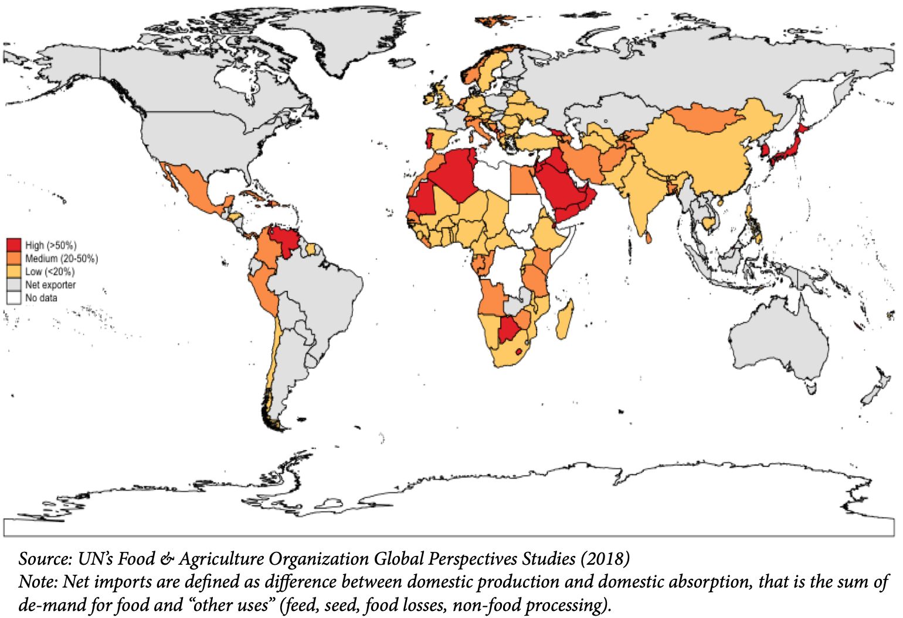

- [Global Overview](#global-overview)
  - [In-depth analyses](#in-depth-analyses)
  - [High-level summaries](#high-level-summaries)
- [Regional](#regional)
  - [Africa](#africa)
  - [Central Asia](#central-asia)
  - [Middle East and North Africa](#middle-east-and-north-africa)

## Global Overview

### In-depth analyses

- UNCTAD, 16 March 2022, ["The Impact on Trade and Development of the War in Ukraine"](https://unctad.org/system/files/official-document/osginf2022d1_en.pdf)
  
  `Trade` `Energy` `Food`

  An assessment of the invasion's impact on food items and countries exposed to supply shocks, on transport, on finance and investment, and on energy transition, with a focus throughout on consumer price increases.

  > The results confirm a rapidly worsening outlook for the world economy, underpinned by rising food, fuel and fertilizer prices, heightened financial volatility, sustainable development divestment, complex global supply chain reconfigurations and mounting trade costs. ¶ This rapidly evolving situation is alarming for developing countries, and especially for African and least developed countries, some of which are particularly exposed to the war in Ukraine and its effect on trade costs, commodity prices and financial markets. The risk of civil unrest, food shortages and inflation-induced recessions cannot be discounted, particularly given the fragile state of the global economy and the developing world as a result of the COVID-19 (coronavirus disease) pandemic.

- FAO, 10 March 2022, ["The importance of Ukraine and the Russian Federation for global agricultural markets and the risks associated with the current conflict"](https://www.fao.org/fileadmin/user_upload/faoweb/2022/Info-Note-Ukraine-Russian-Federation.pdf)

  `Trade` `Energy` `Food` `Macroeconomic`
  
  An in-depth report on trade, production, price, logistical, humanitarian, and energy risks. It includes charts on Russian and Ukrainian export commodities and other countries dependency on those exports, and food price charts.
  
  > During the first week of March 2022, U.S. wheat futures climbed past their record highs reached in 2008. The strength prevailing in wheat markets, that is also influencing maize quotations, which increased by 44 percent above their year-earlier levels in 2021, received a further boost from production uncertainties in South America, higher input and transport costs, as well as port disruptions. In the rapeseed oil and sunflowerseed oil sectors, annual price increases registered in 2021 were in the order of 65 and 63 percent, respectively, being spurred by protracted global supply tightness and robust demand, and in the case of rapeseed oil also from the biodiesel sector. Currently, sunflower oil is being traded at near-record highs. While sunflowerseed oil is highly substitutable with other vegetable oils, wheat is not. Wheat is a staple food for over 35 percent of the world's population, and the lack of substitutability and dietary diversity will likely compound the pressure on wheat prices.
  

### High-level summaries
- UNHCR, 18 March 2022, ["Ukraine Situation Flash Update #4"](https://data2.unhcr.org/en/documents/details/91448)
  
  `Displacement` 

  Summary of refugee situation in Ukraine and surrounding region as Ukrainians flee to neighboring countries and elsewhere. It primarily recounts the work being done by UNHCR.

  > In three weeks, more than 3.2 million refugees have been forced to flee Ukraine, while an additional 6.5 million people have been displaced internally within the country. Over 12 million people have been affected in the areas hardest hit by the war within Ukraine. Humanitarian needs are increasing exponentially.

- Chatham House, 16 March 2022, ["Ukraine crisis could trigger cascading risks globally"](https://www.chathamhouse.org/2022/03/ukraine-crisis-could-trigger-cascading-risks-globally)
  
  `Food` `Transport` `Trade` `Health` `Displacement`

  > Experience from previous food price crises indicate even small interruptions to trade can result in runs on the market and rapid price inflation. In the case of this conflict, the trade interruption will be far from small because, between them, Russia and Ukraine export around one-quarter of all traded wheat, more than three-quarters of traded sunflower oil, and one-sixth of traded maize.

- FAO, 11 March 2022, ["New Scenarios on Global Food Security based on Russia-Ukraine Conflict"](https://www.fao.org/director-general/news/news-article/en/c/1476480)
  
  `Food` `Transport` `Energy`

  Opinion article by FAO Director-General Qu Dongyu.

  > The Ukrainian ports on the Black Sea have shuttered. Even if inland transportation infrastructure remains intact, shipping grain by rail would be impossible because of a lack of an operational railway system. Vessels can still transit through the Turkish Straits, a critical trade juncture through which a large amount of wheat and maize shipments pass. Rising insurance premiums for the Black Sea region would exacerbate the already high costs of shipping, compounding the costs of food imports. And, whether storage and processing facilities would remain intact and staffed is also still unclear.

- World Bank Group, 1 March 2022, [March Trade Watch](https://documents1.worldbank.org/curated/en/723261646946500683/pdf/Trade-Watch-March-2022.pdf) (PDF)

  `Food`
  
  Analysis of recent trade developments with an analysis of the potential impact of the conflict on food trade.

  
  *Percentage of net food imports in domestic food supply (total calories) ([WB Trade Watch](https://documents1.worldbank.org/curated/en/723261646946500683/pdf/Trade-Watch-March-2022.pdf))*

- Brookings, 25 February 2022, ["Around the halls: Implications of Russia’s invasion of Ukraine"](https://www.brookings.edu/blog/order-from-chaos/2022/02/25/around-the-halls-implications-of-russias-invasion-of-ukraine/)
  
  Forecasts and commentaries from 19 Brookings staff on various aspects of the spillover from Russia's invasion.

- International Food Policy Research Institute, 24 February 2022, ["How will Russia’s invasion of Ukraine affect global food security?"](https://www.ifpri.org/blog/how-will-russias-invasion-ukraine-affect-global-food-security)

  `Food`

  > Poor harvests in South America, strong global demand, and supply chain issues have reduced grain and oilseed inventories and driven prices to their highest levels since 2011-2013. Vegetable oil prices have also been at record levels, reflecting the short South American soybean crop, reduced palm oil supplies due to harvest problems in Malaysia, and sharply increased use of palm and soybean oil for biodiesel production. Prices of key energy-intensive inputs like fuel, fertilizer and pesticides have also been at near-record levels.

## Regional 

- IMF, 15 March 2022, ["How War in Ukraine Is Reverberating Across World’s Regions"](https://blogs.imf.org/2022/03/15/how-war-in-ukraine-is-reverberating-across-worlds-regions/)
  
  A blogpost with brief regional breakdowns of spillover effects. While the summaries are short, they offer a regional specificity lacking in the longer reports. 

### Africa
- Africa Policy Research Institute, ["Tracking what the Russia-Ukraine war means for Africa"](https://afripoli.org/tracking-what-the-russia-ukraine-war-means-for-africa)

  A live-updated feed tracking news articles and reports about the implications for Africa of Russia's invasion of Ukraine

- Brookings, 25 Feb 2022, ["What does the war in Ukraine mean for Africa?"](https://www.brookings.edu/blog/africa-in-focus/2022/02/25/what-does-the-war-in-ukraine-mean-for-africa/) (Paywall)

  `Energy` `Macroeconomic`

  Article differentiating how countries will be affected, with some African states perhaps benefiting in the long term (especially those with extractive natural resources), while most countries are hurt in the short term due to their dependence on products exported by Russia and Ukraine.

### Central Asia
- United States Institute of Peace, 15 March 2022, ["Armenia, Azerbaijan and Georgia’s Balancing Act Over Russia’s War in Ukraine"](https://www.usip.org/publications/2022/03/armenia-azerbaijan-and-georgias-balancing-act-over-russias-war-ukraine)

  `Conflict` `Geopolitics` `Remittances`

  A brief exploration of the Nagorno–Karabakh conflict between Armenia and Azerbaijan, and Russia's recognition of Abkhazia and South Ossetia in Georgia, and the effects of Russia's invasion on both. See also ["With Friends Like These: How Russia’s Invasion of Ukraine Hurts Central Asia"](https://www.usip.org/publications/2022/02/friends-these-how-russias-invasion-ukraine-hurts-central-asia) (USIP, Feb 28) for commentary on the effects in Central Asia of sanctions on Russia, and on the region's relationship with Russia.
  
### Middle East and North Africa
- Human Rights Watch, 21 March 2022, ["Russia’s Invasion of Ukraine Exacerbates Hunger in Middle East, North Africa"](https://www.hrw.org/news/2022/03/21/russias-invasion-ukraine-exacerbates-hunger-middle-east-north-africa#)

  `Food`

- World Bank, 7 March 2022, ["Compounded stress: The impact of the war in Ukraine on the Middle East and North Africa."](https://blogs.worldbank.org/arabvoices/compounded-stress-impact-war-ukraine-middle-east-and-north-africa)
  
  `Food` `Energy` `Remittances`